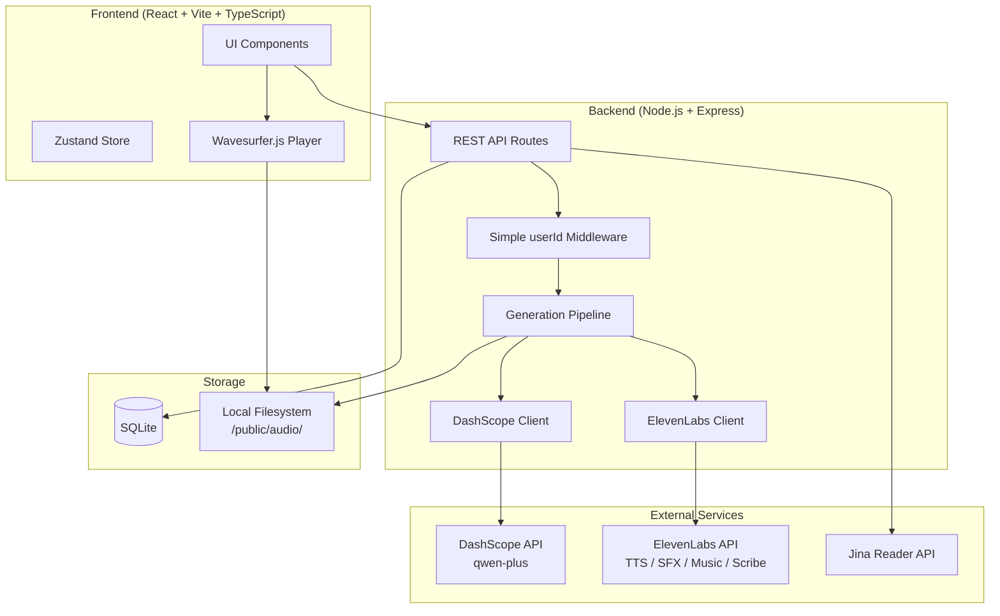
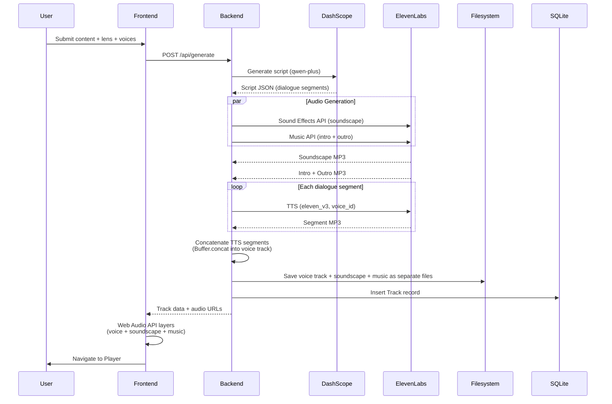

# Design Document: Fathom Audio Learning Engine

## Overview

Fathom is a hyper-personalized audio learning engine that transforms text into two-voice AI podcasts tailored to the user's learning style. The system follows a three-tier architecture: a React SPA frontend, a Node.js/Express API backend, and an SQLite database, with external integrations to Alibaba Cloud DashScope (LLM script generation) and ElevenLabs (TTS, sound effects, music, speech-to-text).

The core generation pipeline is: **User Input → DashScope Script Generation → ElevenLabs TTS + SFX + Music → Audio Assembly → Playback**. The backend generates individual audio files (TTS voice segments, soundscape, intro/outro music) and concatenates only the TTS segments into a single voice track. The frontend uses the Web Audio API to layer the voice track, soundscape, and background music during playback — eliminating the need for server-side ffmpeg mixing. The frontend is a dark-mode-only SPA with a premium, restrained design system inspired by Linear/Vercel — warm zinc-tinted darks, indigo accent used sparingly, Geist Sans typography with tight letter-spacing, border-based elevation, spring-physics animations, and zero decorative gradients. Waveform visualization, transcript sync, and a persistent mini-player complete the experience.

### Design System Philosophy

The visual identity follows a "restrained premium" approach:
- **Color**: Warm zinc-tinted darks (not pure black), indigo accent used only for primary actions, opacity-based text hierarchy
- **Typography**: Geist Sans with tight negative letter-spacing on headings, uppercase labels
- **Elevation**: Borders create depth (not shadows), with subtle box-shadows only on modals/popovers
- **Animation**: Spring-physics via Framer Motion, no decorative animations, respect prefers-reduced-motion
- **Lens identity**: Communicated through subtle color tints + emoji + label text, NOT gradients

### CSS Variables

```css
:root {
  /* Backgrounds — warm-tinted darks, NOT pure black */
  --bg-primary: #09090B;        /* zinc-950 — near-black with warm undertone */
  --bg-secondary: #18181B;      /* zinc-900 — cards, modals, elevated surfaces */
  --bg-tertiary: #27272A;       /* zinc-800 — inputs, hover states, sidebar */
  --bg-elevated: #09090B;       /* same as primary but with subtle border for elevation */
  
  /* Borders — subtle, creates depth through layering */
  --border-primary: rgba(255, 255, 255, 0.08);
  --border-secondary: rgba(255, 255, 255, 0.04);
  --border-focus: rgba(99, 102, 241, 0.5);
  
  /* Text — proper hierarchy with opacity-based system */
  --text-primary: #FAFAFA;       /* zinc-50 — headings, important text */
  --text-secondary: #A1A1AA;     /* zinc-400 — body text, descriptions */
  --text-tertiary: #71717A;      /* zinc-500 — timestamps, disabled, placeholders */
  --text-muted: #52525B;         /* zinc-600 — very subtle labels */
  
  /* Accent — indigo, used SPARINGLY */
  --accent: #6366F1;             /* indigo-500 — primary actions only */
  --accent-hover: #818CF8;       /* indigo-400 — hover state */
  --accent-muted: rgba(99, 102, 241, 0.15);
  
  /* Semantic — muted, not screaming */
  --success: #22C55E;
  --warning: #EAB308;
  --error: #EF4444;
  
  /* Lens accent colors — muted, sophisticated tints */
  --lens-gamer: #8B5CF6;         /* violet-500 */
  --lens-coach: #10B981;         /* emerald-500 */
  --lens-eli5: #F59E0B;          /* amber-500 */
  --lens-storyteller: #F97316;   /* orange-500 */
  --lens-scientist: #3B82F6;     /* blue-500 */
  --lens-popculture: #EC4899;    /* pink-500 */
  --lens-chef: #F97316;          /* orange-500 */
  --lens-streetsmart: #6B7280;   /* gray-500 */
}
```

### Typography System

```css
/* Primary: Geist Sans (Vercel's font) — clean, modern, premium */
--font-sans: 'Geist Sans', 'Inter', -apple-system, 'Segoe UI', system-ui, sans-serif;
--font-mono: 'Geist Mono', 'Berkeley Mono', 'SF Mono', monospace;

/* Heading styles — tight letter-spacing like Linear */
h1 { font-weight: 600; letter-spacing: -0.025em; line-height: 1.1; }
h2 { font-weight: 600; letter-spacing: -0.02em; line-height: 1.2; }
h3 { font-weight: 500; letter-spacing: -0.015em; line-height: 1.3; }
body { font-weight: 400; letter-spacing: -0.011em; line-height: 1.6; }
/* Labels/small text */
.label { font-weight: 500; letter-spacing: 0.01em; text-transform: uppercase; }
```

### Animation System (Spring Physics)

All animations use Framer Motion spring physics. No decorative animations.

```typescript
// Spring configs (Framer Motion)
const SPRING_SNAPPY = { type: "spring", stiffness: 500, damping: 30 };  // buttons, toggles
const SPRING_GENTLE = { type: "spring", stiffness: 300, damping: 25 };  // dialogs, panels
const SPRING_SLOW   = { type: "spring", stiffness: 200, damping: 20 };  // page transitions

// Micro-interactions
// Button press: scale(0.98) on active, spring back
// Card hover: translateY(-1px) + subtle shadow increase, spring
// Dialog open: opacity 0→1 + scale(0.98→1), spring-gentle
// Dialog close: opacity 1→0 + scale(1→0.98), 150ms
// List items: stagger fade-in, 30ms apart, opacity + translateY(4px→0)
// Page transitions: opacity crossfade only, 200ms. NO slide animations.
// Generating pulse: opacity 0.4→1→0.4, 2.5s ease-in-out (CSS, not Framer)
// Progress shimmer: translateX(-100%→100%), 2s linear infinite
```

```css
/* RESPECT prefers-reduced-motion */
@media (prefers-reduced-motion: reduce) {
  *, *::before, *::after {
    animation-duration: 0.01ms !important;
    transition-duration: 0.01ms !important;
  }
}
```

### Elevation System (Borders Create Depth)

| Level | Usage | Background | Border | Shadow |
|-------|-------|-----------|--------|--------|
| 0 | Base page | --bg-primary | none | none |
| 1 | Cards | --bg-secondary | 1px --border-primary | none |
| 2 | Modals/dialogs | --bg-secondary | 1px --border-primary | 0 16px 48px rgba(0,0,0,0.4) |
| 3 | Popovers/dropdowns | --bg-tertiary | 1px --border-primary | 0 8px 24px rgba(0,0,0,0.3) |

### Border Radius

- Cards/modals: 10px
- Buttons/inputs: 6px
- Pills: 9999px
- Small elements (tags, badges): 4px

### Lens Card Design (Lens Picker)

Each lens card in the Lens Picker uses a subtle tint approach (not gradients):
- Background: lens accent color at 8% opacity (e.g., `rgba(139, 92, 246, 0.08)` for Gamer)
- Left border: 2px solid lens accent color
- Text: lens name in --text-primary, description in --text-secondary
- Icon: emoji, 24px
- Hover: background opacity increases to 12%, subtle `scale(1.01)` with spring
- Selected: 1px ring in lens accent color at 50% opacity

### Library Thumbnail Design

Each library thumbnail uses a subtle tint approach (not gradients):
- 56px square with lens accent color at 12% opacity
- Lens emoji centered
- No gradients, no shadows

Voice input (STT) is the hero feature — the Home screen prominently features a large "🎤 Speak your topic" button to encourage the voice-in → podcast-out workflow as the primary demo experience.

## Architecture

### High-Level Architecture Diagram



### Request Flow: Track Generation



### Technology Stack

| Layer | Technology |
|-------|-----------|
| Frontend | React 18, Vite, TypeScript, Tailwind CSS, shadcn/ui, Framer Motion, Wavesurfer.js |
| State Management | Zustand (lightweight, no boilerplate) |
| Backend | Node.js, Express, TypeScript |
| Database | SQLite with `better-sqlite3` driver |
| LLM | Alibaba Cloud DashScope (qwen-plus, OpenAI-compatible) |
| TTS | ElevenLabs SDK (`@elevenlabs/elevenlabs-js`) — eleven_v3 (main), eleven_flash_v2_5 (Hold On) |
| Sound Effects | ElevenLabs Sound Effects API |
| Music | ElevenLabs Music API (`client.music.compose`) |
| Speech-to-Text | ElevenLabs Scribe (`client.speechToText.convert`) |
| URL Scraping | Jina Reader API |
| Auth | Guest mode — display name in localStorage, nanoid-generated userId |
| Audio Layering | Frontend Web Audio API for multi-track playback (voice + soundscape + music) |
| Audio Storage | Local filesystem with Express static serving |

## Components and Interfaces

### Frontend Component Tree

```
App
├── AuthScreen                    # Simple guest mode — enter display name
├── AppLayout                     # Sidebar + content + mini-player
│   ├── Sidebar                   # 56px left nav (desktop ≥768px)
│   ├── BottomTabBar              # 56px bottom nav (mobile <768px)
│   ├── MiniPlayer                # 72px fixed bottom bar (when playing)
│   └── <Routes>
│       ├── HomeScreen
│       │   ├── ContentInput      # Auto-resizing textarea
│       │   ├── VoiceInputButton  # Large "🎤 Speak your topic" hero button
│       │   ├── LensPills         # Horizontal scrollable lens pills
│       │   ├── LensPickerDialog  # 8 lens cards with accent tint backgrounds + audio previews
│       │   ├── VoicePickerTrigger
│       │   ├── VoicePickerDialog # 5 voices × 2 roles
│       │   ├── GenerateButton
│       │   ├── GeneratingState   # Progress bar + status text + "You said: [text]"
│       │   └── FirstRunContent   # Example content + "Try saying: Explain quantum computing like I'm a gamer"
│       ├── PlayerScreen
│       │   ├── PlayerTab
│       │   │   ├── WaveformPlayer    # Wavesurfer.js waveform + controls
│       │   │   ├── HoldOnButton      # Interrupt re-explanation
│       │   │   ├── SoundscapeToggle
│       │   │   ├── MusicToggle
│       │   │   └── PostListenActions # Follow-up suggestions
│       │   ├── TranscriptTab
│       │   │   └── TranscriptSegment # Per-segment with speaker label
│       │   └── InfoTab
│       ├── LibraryScreen
│       │   ├── SearchInput
│       │   ├── FilterControls    # Lens filter + favorites filter
│       │   ├── TrackRow          # Title, lens, duration, date, fav
│       │   └── TrackContextMenu  # Play, share, delete
│       └── SettingsScreen
│           ├── DefaultsSection   # Default lens + voice pair
│           ├── PlaybackSection   # Playback speed
│           └── AccountSection    # Username, created_at, logout
```

### Key Frontend Interfaces

```typescript
// Learning Lens type
type LearningLens = 
  | 'gamer' | 'coach' | 'eli5' | 'storyteller' 
  | 'scientist' | 'pop_culture' | 'chef' | 'street_smart';

// Voice pair configuration
interface VoicePair {
  explainer: { voiceId: string; name: string };
  learner: { voiceId: string; name: string };
}

// Script segment from DashScope
interface ScriptSegment {
  speaker: 'EXPLAINER' | 'LEARNER';
  text: string;
  stageDirection?: string;
}

// Track as returned from API
interface Track {
  id: string;
  title: string;
  sourceText: string;
  lens: LearningLens;
  voiceConfig: VoicePair;
  transcript: TranscriptSegment[];
  audioUrl: string;          // Main voice track (concatenated TTS segments)
  duration: number;
  shareId: string;
  isFavorite: boolean;
  soundscapeUrl: string | null;   // Separate soundscape file for frontend layering
  introMusicUrl: string | null;   // Separate intro music file
  outroMusicUrl: string | null;   // Separate outro music file
  createdAt: string;
}

// Transcript segment with timing for sync
interface TranscriptSegment {
  speaker: 'EXPLAINER' | 'LEARNER';
  text: string;
  startTime: number;  // seconds
  endTime: number;    // seconds
}

// Interrupt record
interface Interrupt {
  id: string;
  trackId: string;
  timestampSec: number;
  explanation: string;
  audioUrl: string;
  createdAt: string;
}

// Zustand store shape
interface AppState {
  // Auth (guest mode — no passwords, no JWT)
  user: { id: string; displayName: string } | null;
  setUser: (displayName: string) => void;
  logout: () => void;

  // Generation
  content: string;
  selectedLens: LearningLens | null;
  voicePair: VoicePair;
  isGenerating: boolean;
  generationPhase: string;
  spokenInput: string | null;  // "You said: [text]" for voice input reinforcement
  generate: () => Promise<Track>;
  cancelGeneration: () => void;

  // Player
  currentTrack: Track | null;
  isPlaying: boolean;
  soundscapeEnabled: boolean;
  musicEnabled: boolean;
  playbackSpeed: number;
  setTrack: (track: Track) => void;
  toggleSoundscape: () => void;
  toggleMusic: () => void;

  // Library
  tracks: Track[];
  fetchTracks: () => Promise<void>;
  toggleFavorite: (id: string) => Promise<void>;
  deleteTrack: (id: string) => Promise<void>;

  // Settings
  defaults: { lens: LearningLens | null; voicePair: VoicePair };
  setDefaultLens: (lens: LearningLens) => void;
  setDefaultVoicePair: (pair: VoicePair) => void;
  setPlaybackSpeed: (speed: number) => void;
}
```

### Backend Module Structure

```
server/
├── index.ts                  # Express app setup, middleware, routes
├── middleware/
│   └── user.ts               # Simple userId extraction from header/cookie
├── routes/
│   ├── auth.ts               # POST /api/auth/guest (create guest user)
│   ├── generate.ts           # POST /api/generate
│   ├── tracks.ts             # GET/DELETE /api/tracks, PATCH favorite
│   ├── interrupt.ts          # POST /api/interrupt
│   ├── share.ts              # GET /api/share/:shareId
│   ├── scrape.ts             # POST /api/scrape-url
│   └── lens-previews.ts      # GET /api/lens-previews
├── services/
│   ├── dashscope.ts          # DashScope API client (OpenAI-compatible)
│   ├── elevenlabs.ts         # ElevenLabs TTS, SFX, Music, Scribe wrapper
│   ├── audio-assembler.ts    # Buffer.concat TTS segments into voice track
│   └── jina.ts               # Jina Reader URL scraping
├── db/
│   ├── database.ts           # better-sqlite3 setup and initialization
│   ├── schema.sql            # SQLite schema DDL
│   └── queries.ts            # Parameterized query functions
├── config/
│   ├── lenses.ts             # Lens metadata, prompts, SFX/music prompts
│   └── voices.ts             # Preset voice definitions
└── utils/
    └── share-id.ts           # nanoid-based share ID generator
```

### API Endpoints

#### Authentication

```
POST /api/auth/guest
  Body: { displayName: string }
  Response: { user: { id, displayName } }
  Notes: Creates a new guest user with nanoid-generated ID. No password required.
         userId is returned and stored in localStorage by the frontend.
         Subsequent requests pass userId via X-User-Id header.
```

#### Track Generation

```
POST /api/generate  [Auth Required]
  Body: { content: string, lens: LearningLens, voiceConfig: VoicePair }
  Response: Track

POST /api/scrape-url  [Auth Required]
  Body: { url: string }
  Response: { text: string }

POST /api/interrupt  [Auth Required]
  Body: { trackId: string, timestampSec: number }
  Response: Interrupt
```

#### Track Management

```
GET /api/tracks  [Auth Required]
  Response: Track[]

GET /api/tracks/:id  [Auth Required]
  Response: Track

PATCH /api/tracks/:id/favorite  [Auth Required]
  Response: Track

DELETE /api/tracks/:id  [Auth Required]
  Response: { success: true }
```

#### Public

```
GET /api/share/:shareId  [No Auth]
  Response: Track (subset: id, title, lens, transcript, audioUrl, duration, soundscapeUrl, introMusicUrl, outroMusicUrl)

GET /api/lens-previews  [No Auth]
  Response: { [lens: string]: string }  // lens → audio URL map
```

### DashScope Client Interface

```typescript
// services/dashscope.ts
interface DashScopeClient {
  generateScript(params: {
    content: string;
    lens: LearningLens;
  }): Promise<ScriptSegment[]>;

  generateReExplanation(params: {
    transcript: TranscriptSegment[];
    timestampSec: number;
    lens: LearningLens;
  }): Promise<string>;
}
```

The DashScope client uses the OpenAI-compatible chat format:
- Base URL: `https://dashscope-intl.aliyuncs.com/compatible-mode/v1`
- Model: `qwen-plus`
- System prompt in `role: "system"` (not `"developer"`)
- `response_format: { type: "json_object" }` for structured output

### ElevenLabs Client Interface

```typescript
// services/elevenlabs.ts
import { ElevenLabsClient } from "@elevenlabs/elevenlabs-js";

interface ElevenLabsService {
  // TTS - main generation (eleven_v3)
  synthesizeSegment(params: {
    text: string;
    voiceId: string;
    previousText?: string;
    nextText?: string;
  }): Promise<Buffer>;

  // TTS - fast re-explanation (eleven_flash_v2_5)
  synthesizeInterrupt(params: {
    text: string;
    voiceId: string;
  }): Promise<Buffer>;

  // Sound Effects API
  generateSoundscape(params: {
    prompt: string;
    durationSeconds: number;
  }): Promise<Buffer>;

  // Music API (client.music.compose)
  generateMusic(params: {
    prompt: string;
    durationMs: number;
  }): Promise<Buffer>;

  // Scribe STT (client.speechToText.convert)
  transcribeAudio(audioBuffer: Buffer): Promise<string>;

  // Voice preview
  generateVoicePreview(voiceId: string, text: string): Promise<Buffer>;
}
```

### Audio Assembly Pipeline

```typescript
// services/audio-assembler.ts
interface AudioAssembler {
  assembleVoiceTrack(params: {
    segmentBuffers: Buffer[];  // ordered TTS segment buffers
  }): Promise<{ outputPath: string; durationSec: number }>;
}
```

Assembly steps (simplified — no ffmpeg):
1. Concatenate all TTS voice segment buffers into a single voice MP3 using `Buffer.concat`
2. Save the concatenated voice track to disk
3. Save soundscape, intro music, and outro music as separate files (already generated by ElevenLabs)
4. Return paths to all files — the frontend handles layering during playback

### Frontend Audio Layering (Web Audio API)

```typescript
// hooks/useAudioLayers.ts
interface AudioLayerController {
  // Load all audio sources for a track
  loadTrack(track: Track): void;

  // Playback control
  play(): void;
  pause(): void;
  seek(timeSec: number): void;

  // Layer volume controls
  setSoundscapeEnabled(enabled: boolean): void;  // mute/unmute, default volume 0.15
  setMusicEnabled(enabled: boolean): void;        // mute/unmute, default volume 0.10

  // Playback sequencing
  // 1. Play intro music (full volume)
  // 2. Start voice track + soundscape (looped, 0.15) + background music (looped, 0.10)
  // 3. When voice track ends, play outro music (full volume)
  
  // State
  currentTime: number;
  duration: number;
  isPlaying: boolean;
}
```

The frontend manages multi-track audio playback:
- **Voice track**: Main Wavesurfer.js waveform renders and plays the concatenated voice MP3
- **Soundscape layer**: Separate `<audio>` element, volume 0.15, looped for duration of voice track
- **Background music layer**: Separate `<audio>` element, volume 0.10, looped for duration of voice track
- **Intro/outro music**: Played sequentially before/after the voice track
- **Toggle controls**: Soundscape and music toggles simply mute/unmute their respective `<audio>` elements


## Data Models

### Database Schema

```sql
-- Users table (guest mode — no passwords)
CREATE TABLE IF NOT EXISTS users (
  id TEXT PRIMARY KEY,              -- nanoid-generated
  display_name TEXT NOT NULL,
  created_at TEXT DEFAULT (datetime('now'))
);

-- Tracks table
CREATE TABLE IF NOT EXISTS tracks (
  id TEXT PRIMARY KEY,              -- nanoid-generated
  user_id TEXT NOT NULL REFERENCES users(id) ON DELETE CASCADE,
  title TEXT NOT NULL,
  source_text TEXT,
  lens TEXT NOT NULL,
  voice_config TEXT,                -- JSON string of VoicePair
  transcript TEXT,                  -- JSON string of TranscriptSegment[]
  audio_url TEXT,
  duration INTEGER,                 -- seconds
  share_id TEXT UNIQUE,
  is_favorite INTEGER DEFAULT 0,    -- SQLite boolean (0/1)
  soundscape_url TEXT,
  intro_music_url TEXT,
  outro_music_url TEXT,
  created_at TEXT DEFAULT (datetime('now'))
);

-- Interrupts table
CREATE TABLE IF NOT EXISTS interrupts (
  id TEXT PRIMARY KEY,              -- nanoid-generated
  track_id TEXT NOT NULL REFERENCES tracks(id) ON DELETE CASCADE,
  timestamp_sec INTEGER NOT NULL,
  explanation TEXT,
  audio_url TEXT,
  created_at TEXT DEFAULT (datetime('now'))
);

-- Indexes for common queries
CREATE INDEX IF NOT EXISTS idx_tracks_user_id ON tracks(user_id);
CREATE INDEX IF NOT EXISTS idx_tracks_share_id ON tracks(share_id);
CREATE INDEX IF NOT EXISTS idx_interrupts_track_id ON interrupts(track_id);
```

### JSON Structures (stored as TEXT in SQLite)

**voice_config** (stored in tracks.voice_config as JSON string):
```json
{
  "explainer": { "voiceId": "abc123", "name": "Marcus" },
  "learner": { "voiceId": "def456", "name": "Aria" }
}
```

**transcript** (stored in tracks.transcript as JSON string):
```json
[
  {
    "speaker": "EXPLAINER",
    "text": "So today we're diving into quantum computing...",
    "startTime": 0.0,
    "endTime": 8.5
  },
  {
    "speaker": "LEARNER",
    "text": "Wait, like actual quantum physics?",
    "startTime": 8.5,
    "endTime": 11.2
  }
]
```

### Lens Configuration Data Model

```typescript
// config/lenses.ts
interface LensConfig {
  id: LearningLens;
  name: string;
  description: string;
  icon: string;           // emoji or icon name
  accentColor: string;    // hex color for subtle tint backgrounds (e.g., '#8B5CF6')
  soundscapePrompt: string;
  musicPrompt: string;
  systemPromptModifier: string;  // injected into DashScope system prompt
}

const LENS_CONFIGS: Record<LearningLens, LensConfig> = {
  gamer: {
    id: 'gamer',
    name: 'Gamer',
    description: 'Level up your knowledge with gaming metaphors',
    icon: '🎮',
    accentColor: '#8B5CF6',  // violet-500
    soundscapePrompt: 'Subtle retro arcade ambience with soft electronic hums and distant game sounds',
    musicPrompt: 'Upbeat chiptune electronic intro, 8-bit inspired, energetic',
    systemPromptModifier: 'Use gaming metaphors, level-up language, boss fights as analogies...',
  },
  // ... other 7 lenses follow same shape (accentColor values:
  //   coach: '#10B981', eli5: '#F59E0B', storyteller: '#F97316',
  //   scientist: '#3B82F6', pop_culture: '#EC4899', chef: '#F97316',
  //   street_smart: '#6B7280')
};
```

### Preset Voice Data Model

```typescript
// config/voices.ts
interface PresetVoice {
  id: string;           // internal identifier
  name: string;         // display name
  description: string;  // e.g., "Warm, authoritative male voice"
  elevenLabsVoiceId: string | null;  // populated after Voice Design API init
  previewAudioUrl: string | null;    // populated after preview generation
}

const PRESET_VOICES: PresetVoice[] = [
  { id: 'marcus', name: 'Marcus', description: 'Warm, authoritative', elevenLabsVoiceId: null, previewAudioUrl: null },
  { id: 'aria', name: 'Aria', description: 'Friendly, energetic', elevenLabsVoiceId: null, previewAudioUrl: null },
  { id: 'kai', name: 'Kai', description: 'Calm, thoughtful', elevenLabsVoiceId: null, previewAudioUrl: null },
  { id: 'luna', name: 'Luna', description: 'Bright, curious', elevenLabsVoiceId: null, previewAudioUrl: null },
  { id: 'rex', name: 'Rex', description: 'Deep, confident', elevenLabsVoiceId: null, previewAudioUrl: null },
];
```

### File Storage Layout

```
public/
└── audio/
    ├── tracks/
    │   ├── {trackId}.mp3           # Final assembled track
    │   └── {trackId}_segments/     # Individual TTS segments (optional, for debugging)
    ├── interrupts/
    │   └── {interruptId}.mp3       # Re-explanation audio
    ├── soundscapes/
    │   └── {trackId}_soundscape.mp3
    ├── music/
    │   ├── {trackId}_intro.mp3
    │   └── {trackId}_outro.mp3
    ├── previews/
    │   ├── voice_{voiceId}.mp3     # Voice preview samples
    │   └── lens_{lensId}.mp3       # 2-second lens audio previews
    └── temp/                       # Temporary files during assembly
```

### State Management (Zustand)

The app uses a single Zustand store split into logical slices:

```typescript
// store/index.ts
import { create } from 'zustand';
import { persist } from 'zustand/middleware';

const useStore = create(
  persist(
    (set, get) => ({
      // Auth slice - persisted (guest mode)
      user: null,  // { id: string, displayName: string }

      // Player slice - not persisted (runtime only)
      currentTrack: null,
      isPlaying: false,
      soundscapeEnabled: true,
      musicEnabled: true,
      playbackSpeed: 1.0,

      // Generation slice - not persisted
      content: '',
      selectedLens: null,
      voicePair: { explainer: PRESET_VOICES[0], learner: PRESET_VOICES[1] },
      isGenerating: false,
      generationPhase: '',
      spokenInput: null,  // "You said: [text]" reinforcement

      // Library slice - not persisted (fetched from API)
      tracks: [],

      // Settings slice - persisted
      defaults: { lens: null, voicePair: null },
    }),
    {
      name: 'fathom-storage',
      partialize: (state) => ({
        user: state.user,
        defaults: state.defaults,
        playbackSpeed: state.playbackSpeed,
      }),
    }
  )
);
```

### Project File Structure

```
fathom/
├── client/                        # Frontend (Vite + React)
│   ├── index.html
│   ├── vite.config.ts
│   ├── tailwind.config.ts
│   ├── tsconfig.json
│   ├── src/
│   │   ├── main.tsx
│   │   ├── App.tsx
│   │   ├── index.css              # Tailwind + CSS variables
│   │   ├── store/
│   │   │   └── index.ts           # Zustand store
│   │   ├── hooks/
│   │   │   ├── useAudioPlayer.ts  # Wavesurfer.js hook (voice track waveform)
│   │   │   ├── useAudioLayers.ts  # Web Audio API multi-track layering
│   │   │   ├── useKeyboardShortcuts.ts
│   │   │   └── useVoiceInput.ts   # Scribe STT hook
│   │   ├── components/
│   │   │   ├── ui/                # shadcn/ui components
│   │   │   ├── layout/
│   │   │   │   ├── AppLayout.tsx
│   │   │   │   ├── Sidebar.tsx
│   │   │   │   ├── BottomTabBar.tsx
│   │   │   │   └── MiniPlayer.tsx
│   │   │   ├── home/
│   │   │   │   ├── ContentInput.tsx
│   │   │   │   ├── VoiceInputButton.tsx  # Large "🎤 Speak your topic" hero button
│   │   │   │   ├── LensPills.tsx
│   │   │   │   ├── LensPickerDialog.tsx
│   │   │   │   ├── VoicePickerDialog.tsx
│   │   │   │   ├── GenerateButton.tsx
│   │   │   │   ├── GeneratingState.tsx
│   │   │   │   └── FirstRunContent.tsx
│   │   │   ├── player/
│   │   │   │   ├── WaveformPlayer.tsx
│   │   │   │   ├── HoldOnButton.tsx
│   │   │   │   ├── SoundscapeToggle.tsx
│   │   │   │   ├── MusicToggle.tsx
│   │   │   │   ├── TranscriptView.tsx
│   │   │   │   └── PostListenActions.tsx
│   │   │   └── library/
│   │   │       ├── TrackRow.tsx
│   │   │       ├── TrackContextMenu.tsx
│   │   │       └── FilterControls.tsx
│   │   ├── screens/
│   │   │   ├── AuthScreen.tsx     # Simple "Enter your name" guest screen
│   │   │   ├── HomeScreen.tsx
│   │   │   ├── PlayerScreen.tsx
│   │   │   ├── LibraryScreen.tsx
│   │   │   ├── SettingsScreen.tsx
│   │   │   └── SharePage.tsx
│   │   ├── lib/
│   │   │   ├── api.ts             # Fetch wrapper with X-User-Id header
│   │   │   └── utils.ts           # Formatters, helpers
│   │   └── types/
│   │       └── index.ts           # Shared TypeScript types
│   └── components.json            # shadcn/ui config
├── server/                        # Backend (Express)
│   ├── index.ts
│   ├── tsconfig.json
│   ├── middleware/
│   │   └── user.ts                # Simple userId extraction from X-User-Id header
│   ├── routes/
│   │   ├── auth.ts                # POST /api/auth/guest
│   │   ├── generate.ts
│   │   ├── tracks.ts
│   │   ├── interrupt.ts
│   │   ├── share.ts
│   │   ├── scrape.ts
│   │   └── lens-previews.ts
│   ├── services/
│   │   ├── dashscope.ts
│   │   ├── elevenlabs.ts
│   │   ├── audio-assembler.ts     # Buffer.concat TTS segments
│   │   └── jina.ts
│   ├── db/
│   │   ├── database.ts            # better-sqlite3 setup (fathom.db)
│   │   ├── schema.sql             # SQLite schema
│   │   └── queries.ts
│   ├── config/
│   │   ├── lenses.ts
│   │   └── voices.ts
│   └── utils/
│       └── share-id.ts
├── public/
│   └── audio/                     # Generated audio files
├── package.json
├── tsconfig.json
└── .env                           # API keys (no DB connection string needed)
```

## Correctness Properties

*A property is a characteristic or behavior that should hold true across all valid executions of a system — essentially, a formal statement about what the system should do. Properties serve as the bridge between human-readable specifications and machine-verifiable correctness guarantees.*

### Property 1: Guest signup creates valid user record

*For any* valid display name string (non-empty, non-whitespace), calling POST /api/auth/guest should create a user row in the database with a non-null nanoid-generated id, the exact display name provided, and a non-null created_at timestamp.

**Validates: Requirements 1.2, 1.4**

### Property 2: Missing userId returns unauthorized

*For any* API request to a protected endpoint without a valid X-User-Id header (missing, empty, or referencing a non-existent user), the backend should return a 401 unauthorized error.

**Validates: Requirements 1.3**

### Property 3: Generate button requires content and lens

*For any* combination of content (empty string, whitespace-only, or non-empty text) and lens selection (null or a valid LearningLens), the generate button should be enabled if and only if the content is non-empty/non-whitespace AND a lens is selected.

**Validates: Requirements 2.6, 3.5**

### Property 4: Script segment structural validity

*For any* generated script output, every segment in the ordered list must have a speaker field that is exactly "EXPLAINER" or "LEARNER", a non-empty text field, and the list must contain at least one segment of each speaker role.

**Validates: Requirements 5.5**

### Property 5: TTS context stitching correctness

*For any* ordered list of N script segments, when synthesizing segment at index i, the previousText parameter should equal segment[i-1].text (or be null/empty when i=0) and the nextText parameter should equal segment[i+1].text (or be null/empty when i=N-1).

**Validates: Requirements 6.2**

### Property 6: Track record completeness

*For any* successful track generation, the resulting Track database record must have non-null values for: title, audio_url, transcript (non-empty array), lens (valid LearningLens), voice_config (valid VoicePair JSON), duration (positive integer), and share_id (non-empty string).

**Validates: Requirements 6.4**

### Property 7: Lens configuration mapping consistency

*For any* LearningLens value, the system prompt modifier, soundscape prompt, and music prompt must all match the predefined configuration for that lens, and no two lenses may share the same soundscape prompt or music prompt.

**Validates: Requirements 5.4, 22.2, 23.2**

### Property 8: Transcript segment time-based lookup

*For any* transcript (ordered list of segments with startTime and endTime) and any playback time t within the track duration, exactly one segment should satisfy startTime <= t < endTime, and that segment should be the one highlighted during playback.

**Validates: Requirements 9.2**

### Property 9: Transcript click seeks to segment start

*For any* transcript segment with a startTime value, clicking that segment should cause the player to seek to exactly that startTime.

**Validates: Requirements 9.3**

### Property 10: Interrupt record completeness

*For any* successful interrupt request, the resulting Interrupt database record must have non-null values for: track_id (matching the requested track), timestamp_sec (matching the requested timestamp), explanation (non-empty string), and audio_url (non-empty string).

**Validates: Requirements 10.5**

### Property 11: Library search filters correctly

*For any* search query string and list of tracks, the filtered result should contain exactly those tracks whose title contains the search string (case-insensitive), and for any lens/favorite filter combination, the result should contain exactly those tracks matching all active filter criteria.

**Validates: Requirements 11.2, 11.3**

### Property 12: Favorite toggle is an involution

*For any* track with any initial is_favorite value, calling PATCH /api/tracks/:id/favorite should flip the boolean. Calling it twice should return the track to its original is_favorite state.

**Validates: Requirements 11.4**

### Property 13: Track deletion removes from database

*For any* track belonging to a user, after calling DELETE /api/tracks/:id, querying the database for that track id should return no result, and GET /api/tracks should not include the deleted track.

**Validates: Requirements 11.6**

### Property 14: Tracks returned in descending creation order

*For any* set of tracks belonging to a user, GET /api/tracks should return them sorted by created_at in descending order (newest first).

**Validates: Requirements 11.8**

### Property 15: Share ID uniqueness and URL format

*For any* set of created tracks, all share_id values must be unique, and the share URL for each track must follow the format `/share/{shareId}` where `{shareId}` matches the track's share_id field.

**Validates: Requirements 12.1, 12.2**

### Property 16: Public share endpoint returns track without auth

*For any* track with a valid share_id, GET /api/share/:shareId without an authentication header should return the track data including title, lens, transcript, audioUrl, and duration.

**Validates: Requirements 12.4**

### Property 17: Cascade delete from users to tracks to interrupts

*For any* user who owns N tracks (each with M interrupts), deleting the user should result in zero tracks and zero interrupts associated with that user's id in the database.

**Validates: Requirements 20.4**

### Property 18: Malformed request body returns 400

*For any* API endpoint that accepts a request body, sending a body with missing required fields or incorrect field types should return a 400 status code with a descriptive validation error message.

**Validates: Requirements 21.9**


## Error Handling

### Backend Error Strategy

All API errors follow a consistent response shape:

```typescript
interface ApiError {
  error: string;    // Machine-readable error code
  message: string;  // Human-readable description
}
```

| Scenario | Status | Error Code | Behavior |
|----------|--------|------------|----------|
| Missing X-User-Id header | 401 | `unauthorized` | Return error, frontend redirects to guest auth |
| User not found for userId | 401 | `unauthorized` | Return error, frontend clears localStorage and redirects |
| Malformed request body | 400 | `validation_error` | Return field-level validation messages |
| Track not found | 404 | `not_found` | Return descriptive message |
| Invalid share_id | 404 | `not_found` | Return "Track not found" |
| DashScope API error | 502 | `llm_error` | Abort generation, return error to frontend |
| DashScope invalid JSON response | 502 | `llm_parse_error` | Abort generation, return error |
| ElevenLabs TTS error (any segment) | 502 | `tts_error` | Abort generation, indicate which segment failed |
| ElevenLabs SFX error | N/A | N/A | Log error, proceed without soundscape (graceful degradation) |
| ElevenLabs Music error | N/A | N/A | Log error, proceed without music (graceful degradation) |
| ElevenLabs Scribe error | 502 | `stt_error` | Stop recording, preserve partial transcript, show error toast |
| Jina Reader error/empty | 502 | `scrape_error` | Return descriptive message about URL scraping failure |
| Database error | 500 | `internal_error` | Log full error, return generic message |
| Voice Design API init failure | N/A | N/A | Log error, retry on next startup |
| Microphone permission denied | N/A | N/A | Frontend shows toast: "Microphone access required" |
| Audio playback failure | N/A | N/A | Frontend shows visible fallback message |

### Graceful Degradation Hierarchy

The audio generation pipeline degrades gracefully when optional components fail:

1. **Full experience**: Voice + Soundscape + Intro/Outro Music + Background Music
2. **No music**: Voice + Soundscape (Music API failed)
3. **No soundscape**: Voice + Music (SFX API failed)
4. **Voice only**: Just the conversation (both SFX and Music failed)
5. **Failure**: DashScope or TTS failure → abort entirely

### Frontend Error Handling

- All API calls wrapped in try/catch with error toast via Sonner
- AbortController used for generation cancellation
- Network errors show "Connection error, please try again" toast
- Audio load failures show visible fallback message in player area
- Missing userId detection: 401 response triggers redirect to guest auth screen

## Testing Strategy

### Testing Framework

- **Unit & Integration Tests**: Vitest
- **Property-Based Tests**: fast-check (with Vitest)
- **Component Tests**: Vitest + React Testing Library
- **E2E Tests**: Not in hackathon scope (manual testing)

### Property-Based Testing Configuration

Each property test uses fast-check with minimum 100 iterations:

```typescript
import { fc } from '@fast-check/vitest';
import { test } from 'vitest';

// Example property test structure
test.prop([fc.string().filter(s => s.trim().length > 0)], { numRuns: 100 })(
  'Feature: fathom-audio-learning-engine, Property 1: Guest signup creates valid user record',
  (displayName) => {
    // ... test implementation
  }
);
```

### Test Organization

```
tests/
├── unit/
│   ├── services/
│   │   ├── dashscope.test.ts       # Script generation logic, prompt construction
│   │   ├── elevenlabs.test.ts      # TTS parameter construction, context stitching
│   │   ├── audio-assembler.test.ts # Assembly order, volume levels
│   │   └── jina.test.ts            # URL scraping error handling
│   ├── db/
│   │   └── queries.test.ts         # Query correctness, cascade behavior
│   ├── config/
│   │   └── lenses.test.ts          # Lens config completeness and uniqueness
│   └── utils/
│       └── share-id.test.ts        # Share ID generation uniqueness
├── properties/
│   ├── auth.property.test.ts       # Properties 1, 2
│   ├── generation.property.test.ts # Properties 3, 4, 5, 6, 7
│   ├── transcript.property.test.ts # Properties 8, 9
│   ├── interrupt.property.test.ts  # Property 10
│   ├── library.property.test.ts    # Properties 11, 12, 13, 14
│   ├── sharing.property.test.ts    # Properties 15, 16
│   ├── database.property.test.ts   # Property 17
│   └── validation.property.test.ts # Property 18
├── integration/
│   ├── routes/
│   │   ├── auth.test.ts
│   │   ├── generate.test.ts
│   │   ├── tracks.test.ts
│   │   ├── interrupt.test.ts
│   │   ├── share.test.ts
│   │   └── scrape.test.ts
│   └── services/
│       ├── dashscope.integration.test.ts
│       └── elevenlabs.integration.test.ts
└── components/
    ├── HomeScreen.test.tsx
    ├── PlayerScreen.test.tsx
    ├── LibraryScreen.test.tsx
    └── WaveformPlayer.test.tsx
```

### Unit Test Focus Areas

- **DashScope client**: Verify prompt construction includes lens-specific modifiers, request uses correct model/format, error handling for invalid JSON responses
- **ElevenLabs client**: Verify TTS calls use correct model (eleven_v3 vs eleven_flash_v2_5), previousText/nextText context stitching logic, SFX/Music prompt selection per lens
- **Audio assembler**: Verify Buffer.concat produces valid MP3, segment ordering preserved
- **Audio layers hook**: Verify volume levels (voice=1.0, soundscape=0.15, music=0.10), mute/unmute toggles, intro→voice→outro sequencing
- **Library filtering**: Search by title, filter by lens, filter by favorites, combined filters
- **Share ID generation**: Uniqueness across many generations
- **User middleware**: userId extraction from X-User-Id header, missing header handling

### Property Test Tag Format

Every property test must include a comment tag referencing the design property:

```typescript
// Feature: fathom-audio-learning-engine, Property 12: Favorite toggle is an involution
```

### Integration Test Focus Areas

- API route contracts (request/response shapes)
- Database cascade deletes
- External API error handling (mocked)
- User middleware on protected routes (X-User-Id header)
- Public share endpoint accessibility without auth
