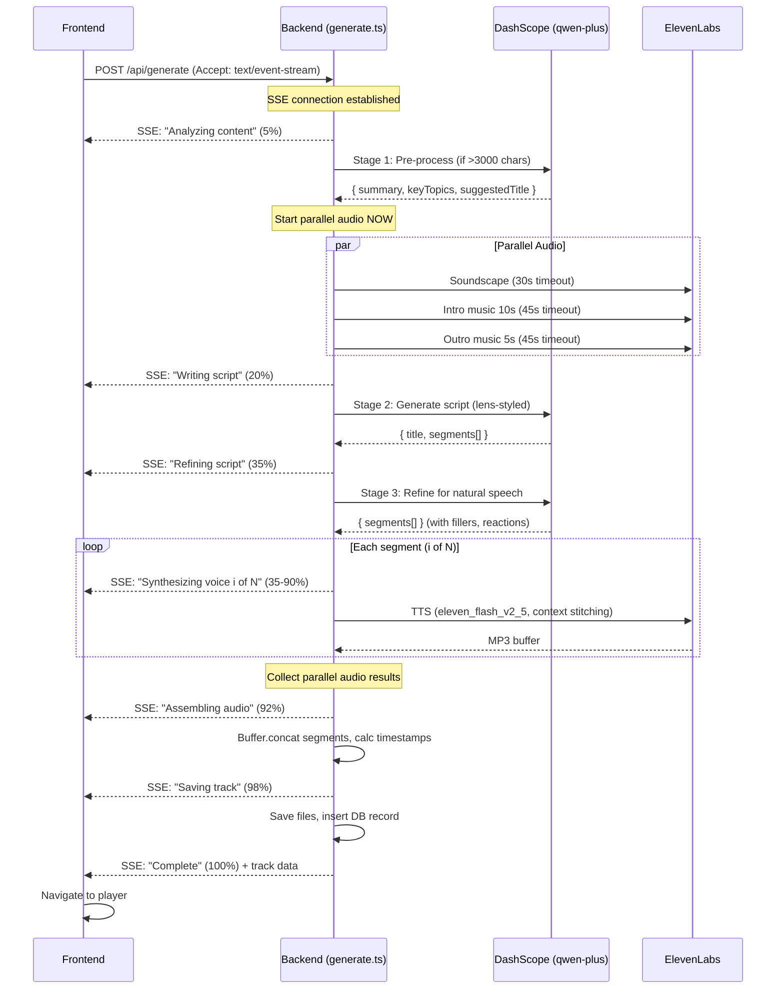
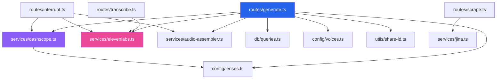

# Design Document: Generation Pipeline Refinement

## Overview

This design refines Fathom's existing generation pipeline from a working prototype into a production-ready system. The current pipeline already implements the core 4-stage flow (pre-process → script → refine → TTS) with parallel soundscape/music generation, SSE progress, and audio assembly. This refinement focuses on hardening each stage with proper timeouts, retry logic, context stitching, voice settings, and structured progress reporting — all based on deep research into NotebookLM/NotebookLlama patterns and the specific APIs we use.

The existing codebase is already well-structured:
- `server/services/dashscope.ts` — 3 stages (preprocess, generate, refine) using qwen-plus via OpenAI-compatible API
- `server/services/elevenlabs.ts` — TTS with retry/timeout, soundscape, music, STT
- `server/services/audio-assembler.ts` — Buffer.concat assembly with duration estimation
- `server/routes/generate.ts` — Full pipeline orchestration with SSE support
- `server/config/voices.ts` — Voice ID mapping with `resolveVoiceId()`
- `server/config/lenses.ts` — Lens configs with soundscape/music/system prompts

The refinement touches are surgical: adding the pre-processing title/topics extraction, ensuring the script refinement preserves segment count, adding proper SSE step percentages matching the spec, adding a 3-minute overall timeout, and ensuring the frontend properly consumes SSE events with a real progress bar (not just cycling messages).

## Architecture

### Refined Pipeline Flow



### Module Dependency Graph



## Components and Interfaces

### Backend Service Interfaces (Refined)

The existing service interfaces are already well-designed. The refinements are minimal:

#### DashScope Service (`server/services/dashscope.ts`)

```typescript
// Stage 1: Pre-process — already implemented, refine output shape
export async function preprocessContent(content: string): Promise<{
  summary: string;
  suggestedTitle?: string;
  keyTopics?: string[];
}>;
// Currently returns string; refine to return structured object
// Fallback: { summary: content.substring(0, 4000) }

// Stage 2: Script generation — already implemented, no changes needed
export async function generateScript(
  content: string,
  lens: LearningLens
): Promise<{ title: string; segments: ScriptSegment[] }>;

// Stage 3: Script refinement — already implemented, no changes needed
export async function refineScript(
  segments: ScriptSegment[]
): Promise<ScriptSegment[]>;
```

**Key refinement**: `preprocessContent` currently returns a plain string. Refine it to return a structured object with `suggestedTitle` and `keyTopics` so the script generation stage can use the suggested title as a hint. The pre-processing prompt already asks for these fields — we just need to surface them.

#### ElevenLabs Service (`server/services/elevenlabs.ts`)

Already production-ready with:
- ✅ `eleven_flash_v2_5` model
- ✅ Conversational voice settings (`stability: 0.4, similarityBoost: 0.75, style: 0.3, useSpeakerBoost: true`)
- ✅ Context stitching (`previousText`, `nextText`)
- ✅ 20s timeout on TTS, 30s on soundscape, 45s on music
- ✅ 2 retries with 2s delay on TTS
- ✅ `mp3_44100_128` output format

No changes needed to the ElevenLabs service.

#### Audio Assembler (`server/services/audio-assembler.ts`)

Already implements:
- ✅ `Buffer.concat` for voice track assembly
- ✅ Duration estimation: `totalBytes / 16000` (128kbps)
- ✅ Separate file saving for soundscape, intro/outro music

**Key refinement**: Add a `calculateTranscriptTimestamps` helper to centralize the per-segment timestamp calculation (currently inline in generate.ts).

```typescript
// New helper to centralize timestamp calculation
export function calculateTranscriptTimestamps(
  segments: Array<{ speaker: string; text: string }>,
  segmentBuffers: Buffer[]
): Array<{ speaker: string; text: string; startTime: number; endTime: number }> {
  let currentTime = 0;
  return segments.map((seg, i) => {
    const duration = segmentBuffers[i].length / 16000;
    const result = { ...seg, startTime: currentTime, endTime: currentTime + duration };
    currentTime += duration;
    return result;
  });
}
```

#### Generate Route (`server/routes/generate.ts`)

The existing route already orchestrates the full pipeline. Refinements:

1. **Structured SSE progress** — Map steps to exact percentages from Req 7
2. **3-minute overall timeout** — Wrap the entire pipeline (Req 8.3)
3. **Use pre-processing suggested title** — Pass to script generation as a hint
4. **Abort controller** — Support client-side cancellation via SSE close

```typescript
// Refined progress step mapping (Req 7.3)
const PROGRESS_STEPS = {
  analyzing:    { step: 'Analyzing content',           percent: 5  },
  writing:      { step: 'Writing script',              percent: 20 },
  refining:     { step: 'Refining script',             percent: 35 },
  // voice synthesis: 35% → 90% (interpolated per segment)
  assembling:   { step: 'Assembling audio',            percent: 92 },
  saving:       { step: 'Saving track',                percent: 98 },
  complete:     { step: 'Complete',                    percent: 100 },
} as const;

// Per-segment voice progress: 35 + (i / total) * 55
function voicePercent(i: number, total: number): number {
  return Math.round(35 + ((i + 1) / total) * 55);
}
```

### Frontend Components (Refined)

#### GeneratingState Component

The current component cycles through hardcoded messages. Refine to consume real SSE progress:

```typescript
// Current: cycles through STATUS_MESSAGES on a timer
// Refined: reads actual SSE step + percent from store

interface GenerationProgress {
  step: string;
  percent: number;
  current?: number;
  total?: number;
}

// In Zustand store, add:
generationProgress: GenerationProgress | null;
setGenerationProgress: (p: GenerationProgress | null) => void;
```

The `GeneratingState` component will:
- Display the real `step` text from SSE events
- Show a determinate progress bar using `percent` (not a shimmer animation)
- Fall back to cycling messages only if SSE events stop arriving

#### HomeScreen SSE Integration

The `HomeScreen` (or its generate handler) needs to:
1. Open an SSE connection via `EventSource` or `fetch` with streaming
2. Parse each `data:` line as JSON
3. Update `generationProgress` in the store
4. On `Complete` event, extract `track` data and navigate to player
5. On `error` event, show error state with retry

```typescript
// In the generate handler (HomeScreen or api.ts)
async function generateWithSSE(body: GenerateBody): Promise<Track> {
  const user = useStore.getState().user;
  const response = await fetch('/api/generate', {
    method: 'POST',
    headers: {
      'Content-Type': 'application/json',
      'Accept': 'text/event-stream',
      'X-User-Id': user?.id || '',
    },
    body: JSON.stringify(body),
  });

  const reader = response.body!.getReader();
  const decoder = new TextDecoder();
  let buffer = '';

  while (true) {
    const { done, value } = await reader.read();
    if (done) break;
    buffer += decoder.decode(value, { stream: true });
    
    // Parse SSE lines
    const lines = buffer.split('\n\n');
    buffer = lines.pop() || '';
    
    for (const line of lines) {
      const match = line.match(/^data: (.+)$/m);
      if (!match) continue;
      const data = JSON.parse(match[1]);
      
      if (data.error) throw new Error(data.error);
      if (data.track) return data.track as Track;
      
      useStore.getState().setGenerationProgress({
        step: data.step,
        percent: data.percent,
        current: data.current,
        total: data.total,
      });
    }
  }
  throw new Error('SSE stream ended without completion');
}
```

### Voice Input (STT) Flow

Already implemented:
- `server/routes/transcribe.ts` — accepts raw audio, calls `transcribeAudio()`
- `server/services/elevenlabs.ts` — `transcribeAudio()` uses Scribe `scribe_v2`
- `client/src/hooks/useVoiceInput.ts` — MediaRecorder hook
- `client/src/components/home/VoiceInputButton.tsx` — UI component

No changes needed for STT.

### URL Scraping Flow

Already implemented:
- `server/routes/scrape.ts` — accepts URL, calls `scrapeUrl()`
- `server/services/jina.ts` — Jina Reader API client

No changes needed for URL scraping.

### Environment Configuration

Already implemented in `server/index.ts`:
- ✅ Manual `.env` parsing with `readFileSync` + line splitting
- ✅ API key status logging at startup
- ✅ Health endpoint with key presence checks

No changes needed.


## Data Models

### No Schema Changes Required

The existing database schema already supports all requirements:
- `tracks` table has all needed columns: `id`, `user_id`, `title`, `source_text`, `lens`, `voice_config`, `transcript`, `audio_url`, `duration`, `share_id`, `soundscape_url`, `intro_music_url`, `outro_music_url`
- `transcript` column stores JSON with `{ speaker, text, startTime, endTime }[]`
- Audio files are stored in `public/audio/` with track ID in filenames

### Refined TypeScript Interfaces

```typescript
// Pre-processing result (refined from plain string)
interface PreProcessResult {
  summary: string;
  suggestedTitle?: string;
  keyTopics?: string[];
}

// SSE progress event shape (Req 7.2)
interface ProgressEvent {
  step: string;
  current: number;
  total: number;
  percent: number;
}

// SSE completion event
interface CompletionEvent {
  step: 'Complete';
  percent: 100;
  track: Track;
}

// SSE error event
interface ErrorEvent {
  error: string;
}

// Union type for all SSE events
type SSEEvent = ProgressEvent | CompletionEvent | ErrorEvent;
```

### File Storage Layout (Unchanged)

```
public/audio/
├── tracks/{trackId}.mp3              # Concatenated voice track
├── soundscapes/{trackId}_soundscape.mp3
├── music/{trackId}_intro.mp3
├── music/{trackId}_outro.mp3
├── interrupts/{interruptId}.mp3
└── temp/                             # Temporary files during assembly
```


## Correctness Properties

*A property is a characteristic or behavior that should hold true across all valid executions of a system — essentially, a formal statement about what the system should do. Properties serve as the bridge between human-readable specifications and machine-verifiable correctness guarantees.*

### Property 1: Pre-processing threshold determines pipeline path

*For any* content string, if its length exceeds 3000 characters then `preprocessContent` SHALL invoke the LLM and return a structured result (summary, suggestedTitle, keyTopics); if its length is 3000 characters or fewer, it SHALL return the original content unchanged without calling the LLM.

**Validates: Requirements 1.1, 1.2**

### Property 2: Pre-processing fallback on failure

*For any* content string and any LLM failure (network error, invalid JSON, timeout), `preprocessContent` SHALL return the original content truncated to at most 4000 characters. The returned string SHALL always be a prefix of the original content.

**Validates: Requirements 1.5**

### Property 3: Lens config drives all pipeline prompts

*For any* valid `LearningLens`, the script generation system prompt SHALL contain that lens's `systemPromptModifier`, and the soundscape generation SHALL use that lens's `soundscapePrompt`, and the music generation SHALL use that lens's `musicPrompt`. No lens SHALL produce prompts from a different lens's config.

**Validates: Requirements 2.2, 5.2**

### Property 4: Script parsing validates structure and enforces constraints

*For any* JSON string returned by the LLM, the script parser SHALL accept it only if it contains a `title` (string) and `segments` (array of objects with `speaker` in {"EXPLAINER", "LEARNER"} and `text` as string). The parser SHALL reject responses with no segments, missing speakers, or invalid JSON. The parser SHALL cap segments at 15 and ensure both speaker roles are present.

**Validates: Requirements 2.3, 2.4**

### Property 5: Refinement fallback preserves original script

*For any* valid script (array of ScriptSegments) and any refinement failure (LLM error, invalid JSON, timeout), `refineScript` SHALL return the original input segments unchanged — same length, same speakers, same text.

**Validates: Requirements 3.5**

### Property 6: Voice ID resolution is correct and total

*For any* internal voice ID in the preset list (marcus, aria, kai, luna, rex), `resolveVoiceId` SHALL return the corresponding ElevenLabs voice ID from the mapping table. *For any* string that is not a known internal ID, `resolveVoiceId` SHALL return the input string unchanged (treating it as an already-resolved ElevenLabs ID).

**Validates: Requirements 4.2**

### Property 7: Context stitching parameters are correctly computed

*For any* ordered sequence of N script segments (N ≥ 1), when synthesizing segment i: `previousText` SHALL equal segment[i-1].text if i > 0, otherwise undefined; `nextText` SHALL equal segment[i+1].text if i < N-1, otherwise undefined. The first segment SHALL have no previousText and the last segment SHALL have no nextText.

**Validates: Requirements 4.4**

### Property 8: Audio assembly produces correct duration and cumulative timestamps

*For any* list of segment buffers (each with known byte length), the assembled voice track duration SHALL equal `sum(buffer.length) / 16000` (rounded). Each transcript segment's `startTime` SHALL equal the sum of all preceding segments' durations, and its `endTime` SHALL equal `startTime + (buffer.length / 16000)`. The last segment's `endTime` SHALL equal the total track duration.

**Validates: Requirements 6.2, 6.3**

### Property 9: Graceful degradation on parallel audio failures

*For any* combination of soundscape/intro/outro generation outcomes (success or failure), the pipeline SHALL complete successfully and produce a valid track. Failed audio layers SHALL result in null URLs in the track record; successful layers SHALL result in valid file paths. The voice track SHALL always be present regardless of parallel audio outcomes.

**Validates: Requirements 5.6**

## Error Handling

### Error Categories and User Messages

| Error Source | User-Facing Message | HTTP Status | Internal Action |
|---|---|---|---|
| DashScope script generation | "Could not generate script. Please try again." | 502 | Log full error, abort pipeline |
| DashScope pre-processing | *(silent fallback)* | — | Log warning, use raw content truncated to 4000 chars |
| DashScope refinement | *(silent fallback)* | — | Log warning, use unrefined script |
| TTS segment failure (after 2 retries) | "Voice synthesis failed on segment X. Please try again." | 502 | Log full error with segment index, abort pipeline |
| Overall timeout (>3 min) | "Generation took too long. Please try with shorter content." | 504 | Log timeout, abort all pending operations |
| Soundscape/music failure | *(silent fallback)* | — | Log warning, proceed without audio layer |
| STT transcription failure | "Speech-to-text transcription failed" | 502 | Log full error |
| URL scraping failure | "Failed to scrape the provided URL" | 502 | Log full error |

### Retry Strategy

- **TTS segments**: 2 retries with 2-second delay (already implemented in `withRetry`)
- **DashScope calls**: No retry (LLM errors are usually deterministic — bad prompt or content)
- **Soundscape/music**: No retry (non-critical, graceful degradation)

### Timeout Hierarchy

```
Overall pipeline: 3 minutes (180s) — new, wraps entire generation
├── Pre-processing: 15s (implicit via LLM call duration)
├── Script generation: no explicit timeout (bounded by overall)
├── Script refinement: 15s (implicit via LLM call duration)
├── TTS per-segment: 20s (with 2 retries = max 66s per segment)
├── Soundscape: 30s
└── Music (each): 45s
```

### SSE Error Delivery

Errors during SSE streaming are sent as JSON in the data field:
```
data: {"error": "Could not generate script. Please try again."}
```

The frontend parses this and transitions to the error state in `GeneratingState`, showing the error message with a retry button.

## Testing Strategy

### Property-Based Testing

This feature is well-suited for property-based testing. The pipeline contains several pure functions and deterministic transformations (threshold checks, voice ID resolution, context stitching computation, duration/timestamp calculation, fallback behavior) that can be validated across many generated inputs.

**Library**: [fast-check](https://github.com/dubzzz/fast-check) for TypeScript/Node.js property-based testing.

**Configuration**: Minimum 100 iterations per property test.

**Tag format**: `Feature: generation-pipeline-refinement, Property {number}: {property_text}`

Each of the 9 correctness properties above maps to a single property-based test:

1. **Pre-processing threshold** — Generate random strings of length 0–10000, verify threshold behavior
2. **Pre-processing fallback** — Generate random strings, mock LLM failure, verify truncation
3. **Lens config drives prompts** — Pick random lens from all 8, verify prompt inclusion
4. **Script parsing** — Generate random JSON structures (valid and invalid), verify parser behavior
5. **Refinement fallback** — Generate random ScriptSegment arrays, mock failure, verify identity
6. **Voice ID resolution** — Generate random voice IDs (mix of known and unknown), verify mapping
7. **Context stitching** — Generate random segment arrays of length 1–20, verify previousText/nextText
8. **Audio assembly timestamps** — Generate random buffer size arrays, verify cumulative math
9. **Graceful degradation** — Generate random success/failure combinations for 3 audio tasks, verify pipeline completion

### Unit Tests (Example-Based)

- Script generation system prompt contains "EXPLAINER" and "LEARNER"
- Script segments capped at 15
- Refinement prompt contains expected instructions (filler words, reactions)
- SSE progress step-to-percent mapping matches spec
- Health endpoint returns expected shape
- DashScope error produces correct user message
- 3-minute timeout produces correct user message
- Music intro is 10000ms, outro is 5000ms

### Integration Tests

- Full pipeline with mocked external services produces a valid track
- SSE stream delivers events in correct order with correct percentages
- Parallel audio generation starts before script generation completes
- Cancel/abort terminates the pipeline cleanly

### What We Don't Test

- LLM output quality (prompt engineering concern, not code correctness)
- ElevenLabs audio quality (external service)
- UI rendering and animations (visual regression / manual testing)
- Browser MediaRecorder behavior (browser API)
